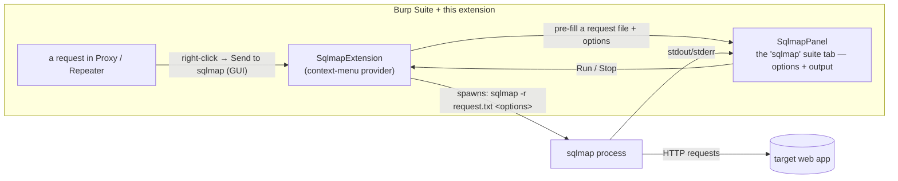

# burp-sqlmap

**A Burp Suite extension that launches and tracks [sqlmap](https://sqlmap.org/) runs from
inside Burp.** Right-click a request → *"Send to sqlmap"* → it pre-fills a request file,
you tweak the options in a dedicated tab, and the extension spawns sqlmap and surfaces its
output without leaving Burp.

[](https://portswigger.net/burp/documentation/desktop/extend-burp/extensions/creating/montoya-api)
[]()
[](LICENSE)

> ## ⚠️ Authorized use only
> SQL-injection testing is intrusive. Use this only against systems you own or are
> explicitly authorized to test (pentest engagement, bug-bounty in-scope, CTF, lab).

## Why

The store extension for this was clunky; this one is a thin, predictable wrapper — Burp
hands a captured request straight to sqlmap, you keep one tab for options/output, and you
never lose Burp's session/scope context.

## How it works



## Install

**Requirements:** Burp Suite (Montoya API), JDK 17+ to build, `sqlmap` on `PATH`.

```bash
./gradlew shadowJar          # -> build/libs/*.jar
# Burp: Extensions → Add → Java → select the jar
```

## Usage

1. In the proxy/repeater, right-click a request → **Send to sqlmap (GUI)**.
2. The **sqlmap** tab opens pre-filled; adjust the target/options.
3. Run; sqlmap's output streams into the tab. Stop from the same tab.

## Layout

```text
src/main/java/com/example/sqlmap/
├── SqlmapExtension.java   # BurpExtension + context-menu provider; spawns sqlmap
├── SqlmapPanel.java       # the "sqlmap" suite tab (options + output)
└── SqlmapSettings.java    # options model
build.gradle               # Java 17, shadowJar
```

## See also

- [`burp-gobuster`](https://github.com/ZZ0R0/burp-gobuster) — content-discovery / fuzzing inside Burp (with [`gocrawlerd`](https://github.com/ZZ0R0/gocrawlerd)).

## License

[MIT](LICENSE)

---

<sub>Part of my work — more at <a href="https://zz0r0.fr">zz0r0.fr</a>.</sub>
